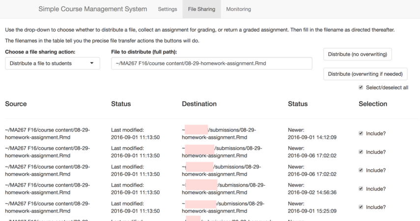
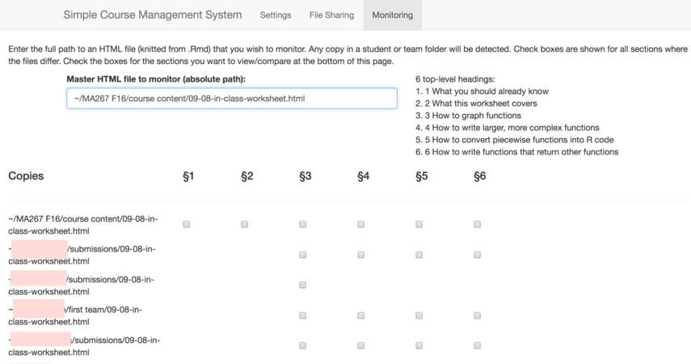

# Simple CMS

This repository holds a **Simple Course Management System** for use on
RStudio Server Pro instances. It is distributed as an Addin for RStudio, to
be run on the server.

## Features

The target audience is instructors teaching courses in which student work
takes place in R, usually in RMarkdown documents, on an RStudio Server Pro
instance.

The Addin provides the instructor a GUI with these features:

 * distributing files to students
 * collecting assignments from students (automatically attaching students'
   names to the files)
 * returning graded assignments to students (automatically renaming so as
   not to collide with ungraded versions)
 * monitoring in-class work students are doing on the server live

To see these in action, see [the screencasts section,](#screencasts) below.

## Prerequisites

The addin assumes you're running RStudio Server with Project Sharing enable.
To be sure that your server supports project sharing, check out [the entry
in the admin
guide](http://docs.rstudio.com/ide/server-pro/r-sessions.html#project-sharing)
for how to set that up.

## Installation

To install it, take these steps from within RStudio on your server:

 1. From your R console, run `install.packages('devtools')`.
    (Depending on your server configuration, you may find that this requires
    you to install various development packages on the underlying Unix
    system to complete this command successfully.)
 2. Load that installed package with `library('devtools')`.
 3. Next, run `install_github('nathancarter/simplecms')`.
 4. The Addin should then be available on your Addins menu in the toolbar
    (or as a submenu on the Tools menu).

## Setup

Before running the addin:

 1. Create a subfolder of your home folder that you will use as the
    destination when you collect student work.  For example,
    `~/my-course/files-to-grade/`.
 2. Create an account on the server for each student in your cousre.
    Ensure the students can log into their accounts.
 3. Have each student create a project in their home directory that they
    will use to submit assignments to you.  Each student must name this
    project with the exact same name.  In my courses, I we this the
    `submissions` project.  Have each student share this project with you.
 4. If you plan to have students work on teams, have one member from each
    team create a project and share it with their team and with you as the
    instructor.  Use a consistent naming convention, such as all projects
    being named `my-team`.

Configuring the addin:

 1. Run the addin from the Addins menu in RStudio Server Pro.
 2. Ensure the Settings tab is active.
 3. Fill in the "Students" blank with a list of the usernames of all
    students in your course.
 4. Enter your grading folder in the first blank under the "Folders"
    section, for example, `~/my-course/files-to-grade/`.
 5. Enter the name of the project each of your students shared with you in
    the second blank, for example, `submissions`.
 6. If your students are working on teams and you will want to monitor their
    work live in class, enter the name of their team project folders in
    the final Folders blank, for example, `my-team`.
 7. The MathJax blank is not necessary unless later you will be distributing
    in-class worksheets that contain LaTeX definitions, and you will want
    those definitions respected in your live monitoring of student in-class
    work.  If so, copy those definitions here, for example,
    `\def\Z{\mathbb{Z}}` for the integers.

## Screenshots

In all screenshots, pink squares obscure my students' names for privacy.

### Settings page

### Distribute/collect/return files page

The drop-down menu on the left contains three options: Distribute a file to
students, Collect an assignment from students, and Return a graded
assignment to students.

### Monitor student work live

The grid of checkboxes shows which sections have been edited by students, so
that you can track student progress on in-class worksheets.  You can
showcase the work of a student or team, or compare versions, by checking
boxes and scrolling down, where their contents will be previewed live.

## Screencasts

### [Distributing a file to students (YouTube)](https://youtu.be/TCAEaODj_-M)

### [Collecting student work (YouTube)](https://youtu.be/NKZ9U4fktVE)

### [Providing feedback](https://youtu.be/QokCVrDzPQs)

### [Returning graded files to students](https://youtu.be/dMb_hg8I0UM)

### [Live monitoring of in-class work](https://youtu.be/57nXUu6CGeo)

## License

[LGPL3](LICENSE)
