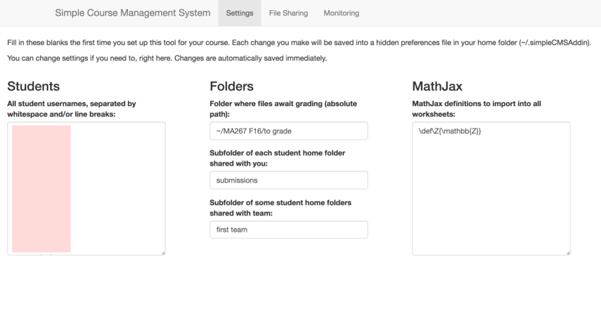

# Simple CMS

## Summary

This repository holds a Simple Course Management System for use on RStudio Server Pro instances.
It is distributed as an Addin for RStudio, to be run on the server.

## Features

The target audience is instructors teaching courses in which student work takes place in R, usually in RMarkdown documents, on an RStudio Server Pro instance.

The Addin provides the instructor a GUI with these features:

 * distributing files to students
 * collecting assignments from students (automatically attaching students' names to the files)
 * returning graded assignments to students (automatically renaming so as not to collide with ungraded versions)
 * monitoring in-class work students are doing on the server live

## Installation
 
To install it, take these steps from within RStudio on your server:

 1. From your R console, run `install.packages('devtools')`.
 2. Next, run `install_github('nathancarter/simplecms')`.
 3. The Addin should then be available on your Addins menu in the toolbar (or as a submenu on the Tools menu).

## Screenshots

In all screenshots, pink squares obscure my students' names for privacy.

### Settings page

### Distribute/collect/return files page

The drop-down menu on the left contains three options: Distribute a file to students, Collect an assignment from students, and Return a graded assignment to students.

### Monitor student work live

The grid of checkboxes shows which sections have been edited by students, so that you can track student progress on in-class worksheets.  You can showcase the work of a student or team, or compare versions, by checking boxes and scrolling down, where their contents will be previewed live.

## License

[LGPL3](LICENSE)
